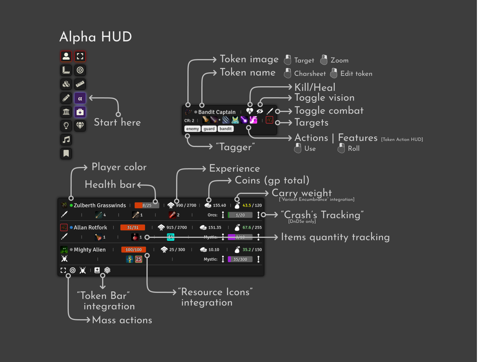

# Alpha HUD
All essential information is at your fingertips!
This module accumulates your tokens data and places it in your workspace.
Also, it has a lot of handy shortcuts to manipulate them.
It supports many third-party modules to be their companion, not a substitute.

## Systems
This module is developing primarily for DnD5e, but all basic features should work with others.
In addition, it tested and somewhat supported with Pathfinder and Pathfinder 2e.

## Integrations
* Item Piles
* Variant Encumbrance
* Resource Icons
* Crash's Tracking & Training
* Monk's Token Bar
* Token Action HUD
* Item Collections (Containers)
* Tagger
* Director

## TODO:
- [ ] More settings
- [ ] Non-GM mode
- [ ] Combat widget
- [ ] [Director](https://github.com/averrin/director) integrations. Scene widget with something like hotbar.

## Hints

- You can 

## My modules
- [Director](https://github.com/averrin/director)
- [Merchant Control](https://github.com/averrin/merchant-control)

## Attribution
It uses some parts from [Party Overview](https://github.com/mclemente/party-overview) module which is licensed under MIT license
and [Token Action HUD](https://github.com/Drental/fvtt-tokenactionhud) licensed under [Foundry Virtual Tabletop EULA - Limited License Agreement for module development](https://foundryvtt.com/article/license/).

